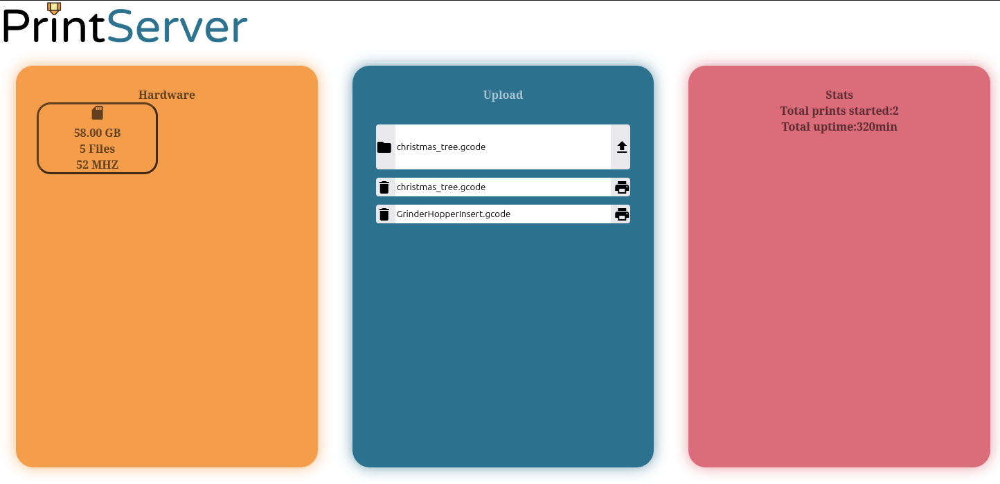
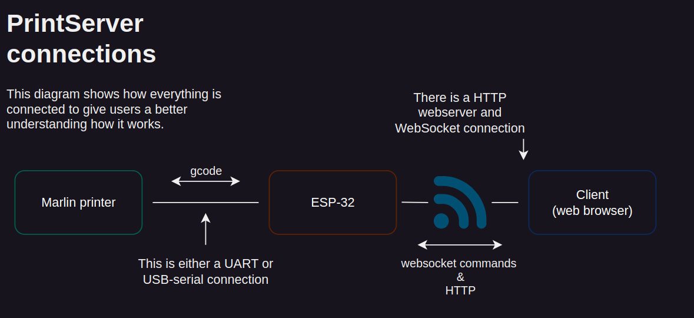

> Please note that this project is still in really early developement and it is not recommended to use this project for any applications just yet :)

# Welcome to the PrintServer GitHub page!
## What exactly does this project do?

To put it really simple this project makes your **marlin** 3D-printer wireless! It uses an ESP-32 as a server that hosts a webserver. This ESP-32 is connected directly to the printer and is able to send it G-code commands. You can access the website from your home network to manage your printer and upload files to print. The files are stored directly on the sd card of the print server, which makes uploading to the print server quite fast! This project is lightweight so the printer is able to print quite fast before you will see the performance limitations of the ESP-32.

On the webpage there is quite limited information shown (for now). You have the info about the SD-card connected to the server. The files that are stored on the server's SD-card and some data related to the server & printer.

## What are the current limitations
Currently all the esp microcontrollers work if you are willing to solder the uart connections directly to the printer's motherboard. This is something that still needs to be worked on. This functionality will stay to support a wider range of ESP-32's. Later USB-Host support will be added so you can interface directly to the printer without needing to solder to it's motherboard. Currently an SD-card adapter with a 4 bit wide bus is only supported. Eventhough there was support for it in earlier commits (so you could quite easily implement it yourself ;)). Using a 4 bit wide bus for reading and writing to the SD-card is highly reccomended as we found that the SPI-interface is really quite slow... Otherwise a lot still need to be polished and support/features need to be added, though currently this project works quite well!

## Building
This project uses **platformio** and the **esp-idf**. Currently you can clone the project and add your board to the platformio.ini file. You might need to change some settings in the menuconfig (under **platform** in the **platformio project tasks**)

## Diagram

### Webserver commands
Instead if parsing JSON we use more simple to parse commands (since the hardware limitations). These commands can be found here for the [client->server](doc/websocket_commands_to_server.md) and [server->client](doc/websocket_commands_to_client.md).

### Storing print data
Some data about the printer will be stored in the SD-card. This is because when the ESP-32 is turned off it loses all the data stored in the ram. The data is saved and loaded in the [saved_server_data_t](src/server_data.h) struct. Any new data that will be added is automatically stored in the binary file!

